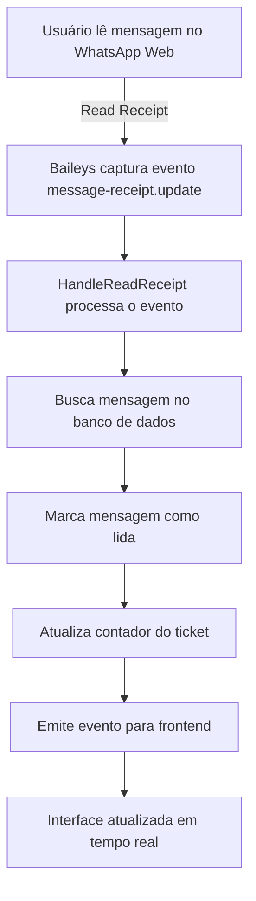
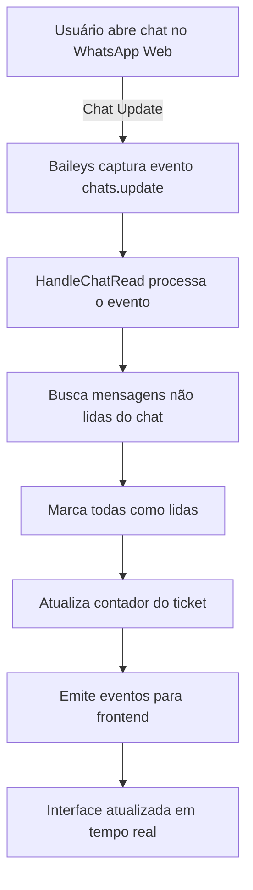

# 📱 Sincronização de Mensagens Lidas - WhatsApp Web/Business

## 📋 Resumo

Este documento descreve as implementações feitas para sincronizar o status de mensagens lidas entre o WhatsApp Web/Business e o sistema do chat. Quando o usuário lê uma mensagem no WhatsApp Web/Business, ela será automaticamente marcada como lida no sistema.

## 🔧 Implementações

### 1. Handler para Read Receipts (`StartWhatsAppSession.ts`)

**Localização:** `backend/src/services/WbotServices/StartWhatsAppSession.ts`

**O que foi adicionado:**
- Handler para o evento `message-receipt.update` que captura quando mensagens são lidas
- Handler para o evento `chats.update` que captura quando chats inteiros são marcados como lidos
- Função `handleReadReceipt` para processar os eventos

```typescript
// Handler para read receipts - quando mensagens são lidas pelo usuário remoto
wbot.ev.on("message-receipt.update", async (receipts: any[]) => {
  try {
    for (const receipt of receipts) {
      // Processar apenas receipts de leitura (read)
      if (receipt.receipt && receipt.receipt.readTimestamp) {
        await handleReadReceipt(receipt, whatsapp.tenantId);
      }
    }
  } catch (err) {
    logger.error(`[message-receipt.update] Error processing read receipts: ${err}`);
  }
});
```

### 2. Serviço Especializado (`HandleReadReceipt.ts`)

**Localização:** `backend/src/services/WbotServices/helpers/HandleReadReceipt.ts`

**Funcionalidades:**
- `HandleReadReceipt`: Processa read receipts individuais
- `HandleReadReceiptBatch`: Processa múltiplos read receipts
- `HandleChatRead`: Marca mensagens de um chat como lidas quando o usuário abre a conversa

**Processo:**
1. Recebe o read receipt do WhatsApp
2. Busca mensagens correspondentes no banco de dados
3. Marca as mensagens como lidas (`read: true`)
4. Atualiza o contador de mensagens não lidas do ticket
5. Emite eventos para o frontend via WebSocket

### 3. Melhoria no HandleBaileysMessage (`HandleBaileysMessage.ts`)

**Localização:** `backend/src/services/BaileysServices/HandleBaileysMessage.ts`

**O que foi melhorado:**
- Função `handleMessageReadReceipt` agora implementa lógica real
- Marca mensagens como lidas no WhatsApp automaticamente quando o ticket está em atendimento
- Usa timeout para evitar travamentos

## 🔄 Fluxo de Funcionamento

### Cenário 1: Usuário lê mensagem no WhatsApp Web/Business



### Cenário 2: Usuário abre chat no WhatsApp Web/Business



## 🎯 Eventos WebSocket Emitidos

### 1. `chat:ack`
```json
{
  "type": "chat:ack",
  "payload": {
    "id": "message_id",
    "messageId": "whatsapp_message_id",
    "ticketId": "ticket_id",
    "ack": 3,
    "read": true,
    "status": "read",
    "fromMe": false
  }
}
```

### 2. `chat:messagesRead`
```json
{
  "type": "chat:messagesRead",
  "payload": {
    "ticketId": "ticket_id",
    "messageId": "whatsapp_message_id",
    "readTimestamp": 1640995200000
  }
}
```

### 3. `ticket:update`
```json
{
  "type": "ticket:update",
  "payload": {
    "id": "ticket_id",
    "unreadMessages": 0
  }
}
```

## 🔧 Configurações e Logs

### Logs de Debug
Para ativar logs de debug específicos para read receipts:

```javascript
// No arquivo de configuração do logger
logger.level = 'debug';
```

### Logs Importantes
- `[HandleReadReceipt] Processando read receipt para mensagem {messageId} no chat {chatId}`
- `[HandleReadReceipt] Mensagem {messageId} marcada como lida no sistema`
- `[HandleChatRead] {count} mensagens marcadas como lidas para chat {chatId}`

## ⚠️ Considerações Importantes

### 1. Performance
- Os read receipts são processados em background para não bloquear outras operações
- Usa `Promise.allSettled` para processar múltiplos receipts sem falhar se um der erro

### 2. Sincronização Bidirecional
- **WhatsApp → Sistema**: Implementado via read receipts
- **Sistema → WhatsApp**: Implementado via `wbot.readMessages()` com timeout

### 3. Tratamento de Erros
- Erros são logados mas não interrompem o fluxo principal
- Timeout de 5 segundos para evitar travamentos
- Fallback para casos onde read receipts não funcionam

## 🧪 Testando a Funcionalidade

### Teste Manual
1. Envie uma mensagem do sistema para um contato
2. Abra o WhatsApp Web/Business
3. Leia a mensagem no WhatsApp
4. Verifique se a mensagem aparece como lida no sistema
5. Contador de mensagens não lidas deve ser atualizado

### Logs para Verificar
```bash
# Filtrar logs relacionados a read receipts
tail -f logs/app.log | grep "HandleReadReceipt"

# Verificar eventos WebSocket
tail -f logs/app.log | grep "chat:messagesRead"
```

## 🔄 Manutenção

### Monitoramento
- Verificar logs regularmente para erros de read receipt
- Monitorar performance dos handlers de eventos
- Acompanhar métricas de sincronização

### Possíveis Melhorias Futuras
- Cache de read receipts para reduzir consultas ao banco
- Batch processing para múltiplos receipts
- Métricas de sincronização para dashboard 